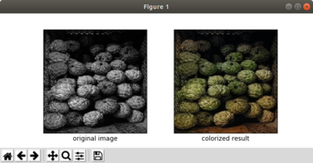
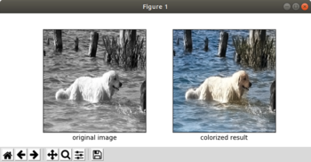
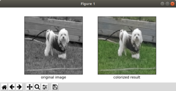
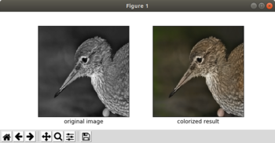

# Simple Colorization

This [MLHub](https://mlhub.ai) package supports a pre-built model from
[Yang Liu]() providing a very simple example of photo colorization
using deep neural networks. For the demonstration a sample of provided
black and white photos are colorized and displayed. You can add colour
to your own local photos, a folder of photos, a photo on the Internet
using the *color* command line tool.

Visit the github repository for more details:
https://github.com/mlhubber/colorize

## Usage

- To install mlhub (Ubuntu)

  ```console
  $ pip3 install mlhub
  ```

* To install and configure the pre-built model:

  ```console
  $ ml install   colorize
  $ ml configure colorize
  ```

## Command Line Tools

An demonstration of the package is presented below using the *demo*
command. The package also provides a number of useful command line
tools.

*Colorize Photos*

The *color* command will colorize a photo and optionally
(--interactive) display the original and the colorized versions.

The command is useful in the context of colourising multiple photos,
perhaps thousands of them by invoking the command with a single file
argument on the command line, multiple files listed on the command
line, a path to a folder containing photos, or the URL of an online
photo.

To colorize a photo from a local file and to display the result
interactively:

```console
$ ml color colorize --interactive image_07_bw.png
image_07_bw.png,image_07_bw_color.png
```

The colorized photo will be saved into the file 
`image_07_bw_color.png`, within the local folder, noting the addition of
the `_color` suffix. 

The text output from the command names the original photo file and the
generated photo file. This can be piped into other commands for
further processing. Thus, you can use your own tool to view the
photo's if you wish:

```console
$ ml color colorize image_07_bw.png |
  cut -d, -f2 |
  xarg display
```

To colorize images in a folder:
```console
$ ml color colorize ~/.mlhub/colorize/images
/home/gjw/.mlhub/colorize/images/image_01_bw.png,image_01_bw_color.png
/home/gjw/.mlhub/colorize/images/image_02_bw.png,image_02_bw_color.png
/home/gjw/.mlhub/colorize/images/image_03_bw.png,image_03_bw_color.png
/home/gjw/.mlhub/colorize/images/image_04_bw.png,image_04_bw_color.png
/home/gjw/.mlhub/colorize/images/image_05_bw.png,image_05_bw_color.png
/home/gjw/.mlhub/colorize/images/image_06_bw.png,image_06_bw_color.png
/home/gjw/.mlhub/colorize/images/image_07_bw.png,image_07_bw_color.png
/home/gjw/.mlhub/colorize/images/image_09_bw.png,image_09_bw_color.png
/home/gjw/.mlhub/colorize/images/image_10_bw.png,image_10_bw_color.png
```
This will save the colorized photos into the local folder from where
the command is run.

To colorize an image from the web:

```console
$ ml color colorize https://flower-wallpaper.org/wp-content/uploads/2016/10/black-and-white-flowers-wallpaper2.jpg
$ ml color colorize https://flower-wallpaper.org/wp-content/uploads/2016/10/black-and-white-flower-wallpaper1-310x165.jpg
```

To interatively colorize without repeatedly reloading the model:

    ```console
    $ ml color colorize --interactive
    Path or URL of images to colorize (Quit by Ctrl-d):
    (You could try images in '~/.mlhub/colorize/images/')
    > https://flower-wallpaper.org/wp-content/uploads/2016/10/black-and-white-flowers-wallpaper2.jpg
	> https://flower-wallpaper.org/wp-content/uploads/2016/10/black-and-white-flowers-wallpaper5-1.jpg
	> https://www.designsmag.com/wp-content/uploads/2017/06/Black-White-Photography-DesignsMag-011.jpg
    ```

## Demonstration

```console
$ ml demo colorize
Loading the required Python modules ...

Loading the model ...
Demonstrate colorization using images found in
 /home/gjw/.mlhub/colorize/images 

Please close each image (Ctrl-w) to proceed through the demonstration.

Colorize image_01_bw.png
```

```console
Colorize image_02_bw.png
```

```console
Colorize image_03_bw.png
```

```console
Colorize image_04_bw.png
```

```console
Colorize image_05_bw.png
```

```console
Colorize image_06_bw.png
```

```console
Colorize image_07_bw.png
```

```console
Colorize image_09_bw.png
```

```console
Colorize image_10_bw.png
```

```console

To colorize images given by a path or URL:

  $ ml apply colorize

```

